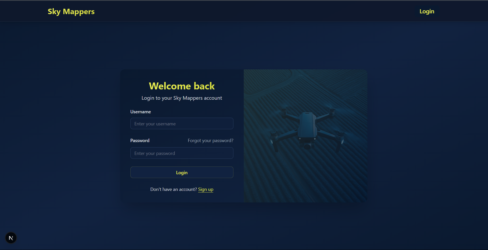
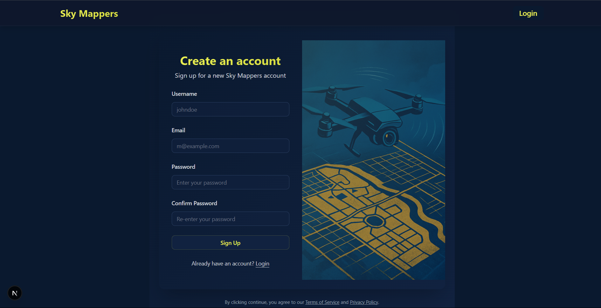
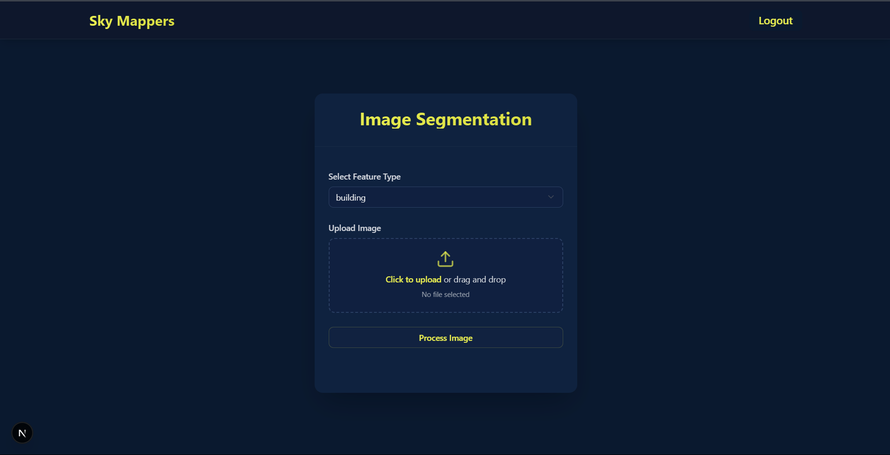
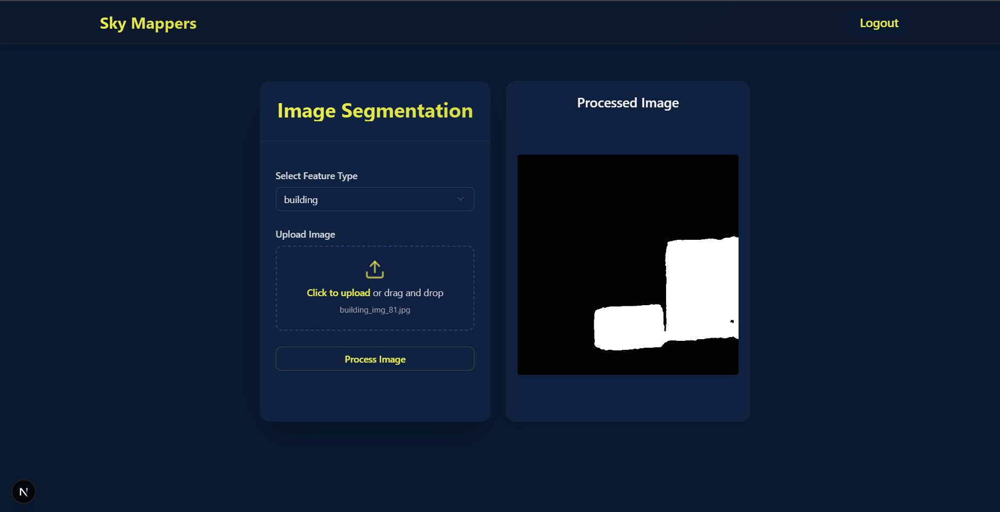
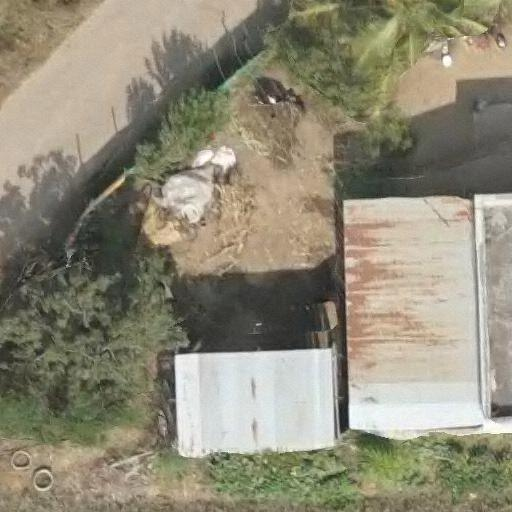

<<<<<<< HEAD
# 🌐 Sky Mappers

**Sky Mappers** is a full-stack geospatial intelligence platform that allows users to upload aerial or satellite imagery and perform **semantic segmentation** to detect key infrastructure and land-use features using AI.

---

## 🛠️ Tech Stack

- 🔧 **Frontend**: [Next.js](https://nextjs.org/) (React)
- 🔧 **Backend**: [Django](https://www.djangoproject.com/) (Django REST Framework)

---

## 🧠 What It Can Detect

Sky Mappers can segment:

- 🏢 **Buildings**
- 🛣️ **Roads**
- 🌊 **Water Bodies**
- 🏡 **Rooftop Types**:
  - RCC (Reinforced Cement Concrete)
  - Tiled Roofs
  - Asbestos Sheets

---

## 🔐 Authentication & User Flow

- 🧾 **User Registration** (`/register`)
- 🔐 **Login** (`/`)
- 📊 **Protected Dashboard** (`/dashboard`)
- 🔓 **JWT-based authentication**
- ✅ Secure access to upload and processing features

---

## 📦 Key Features

- 📤 Upload drone/satellite images
- 🎯 Choose target feature to segment
- 🧠 Server-side AI performs semantic segmentation
- 🖼️ Real-time result display
- 🔄 REST API integration (Next.js ↔ Django)
- 🛡️ Protected routes with token verification

---

## 🖼️ Screenshots

### 🔐 Login Page


### 🧾 Register Page


### 📊 Dashboard – Before Upload


### 🧠 Dashboard – After Image is Uploaded and Processed


### 🌍 Sample Input (Aerial Image)


---

## 📁 Project Structure

```text
Sky_Mappers/
├── Backend/
│   ├── manage.py
│   ├── requirements.txt
│   └── sky_mappers/
│       ├── settings.py         # CORS, DRF, auth setup
│       ├── urls.py
│       ├── api/                # Segmentation logic
│       └── users/              # Login & registration
├── terraview/
│   ├── package.json
│   ├── public/
│   │   └── bg.png, reg.png     # UI assets
│   ├── src/
│   │   ├── app/
│   │   │   ├── layout.js
│   │   │   ├── page.jsx        # Login
│   │   │   ├── register/page.jsx
│   │   │   └── dashboard/page.jsx
│   │   └── components/
│   │       ├── Navbar.jsx
│   │       ├── login-form.jsx
│   │       ├── RegisterForm.jsx
│   │       └── imageUploader.jsx
│   └── styles/
│       └── globals.css
└── README.md
=======
# DermaX
>>>>>>> 9240b1431cd5c7d515a1bdaec328160380a6c45c
